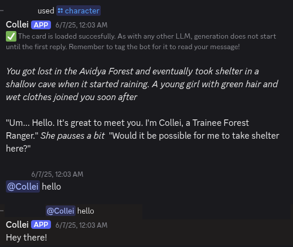
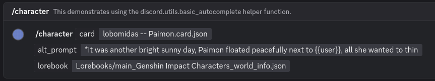

# KoboldCPP Discord Bot
Discord bot that uses [KoboldCPP](https://github.com/LostRuins/koboldcpp) API and character cards to pretend to be a character.

# Features
- Set installed character cards or pick one from your files using the /upload feature
- If using installed cards and the card supports alternative starting prompts, you can select an alternative prompt with the /character command.
- Set a lorebook along with the character card to enhance your character.
- Replace {{char}} and {{user}} output with the character and discord user's name for more realistic conversations. It will do this on a per-message basis so multiple users can reply.
- Only connects to the KoboldCPP API and Discord. No need to worry about API subscriptions or revoked API access!

# Setup
1. Download main.py
2. If you want to install character cards, place the downloaded .json files next to main.py. Otherwise you can use the /upload command to temporarily set the character.
3. If you want to install .json lorebooks (Other than ones that come with a character card), create a Lorebooks folder next to main.py and place them inside. You can then use these with the /character command.
4. Set `DISCORD_TOKEN` environment variable or modify main.py
5. Start KoboldCPP on your PC or change endpoint in main.py to a known server that supports the KoboldCPP API
6. Run bot and use /upload or /character command
